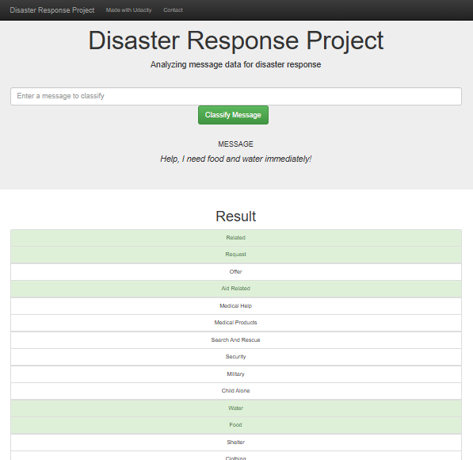

# Disaster Response Pipeline Project

This project is a web application designed to classify disaster response messages, allowing for faster and more effective handling of disaster communications. By categorizing messages, organizations can prioritize responses, helping communities in need during disaster situations.

## Project Overview

The project consists of:
- An ETL (Extract, Transform, Load) pipeline for cleaning and processing the data.
- An ML (Machine Learning) pipeline that builds a text classifier using natural language processing (NLP) techniques.
- A Flask web application to provide an interactive platform for message classification.

## Project Structure

The project folder is organized as follows:


```
Disaster_Response_App
├── app
│   ├── templates
│   │   ├── go.html
│   │   └── master.html
│   └── run.py
├── data
│   ├── DisasterResponse.db
│   ├── disaster_categories.csv
│   ├── disaster_messages.csv
│   └── process_data.py
├── models
│   ├── classifier.pkl
│   └── train_classifier.py
├── requirements.txt
├── render.yaml
├── Procfile
├── .gitignore
├── assets
│   └── DisasterResponseProject.png
└── README.md
```

## Instructions

Follow these steps to set up and run the project.

### 1. Set up the Database and Model

In the root project directory, use the following commands:

1. Run the ETL pipeline to clean the data and store it in a database:
   `python data/process_data.py data/disaster_messages.csv data/disaster_categories.csv data/DisasterResponse.db`

2. Run the ML pipeline to train the model and save it as a pickle file:
   `python models/train_classifier.py data/DisasterResponse.db models/classifier.pkl`

### 2. Launch the Web Application Locally

1. Navigate to the `app` directory:
   `cd app`

2. Start the Flask web application:
   `python run.py`

3. Open a browser and go to `http://127.0.0.1:5000` or `http://localhost:5000` to interact with the app.


## Access the Web Application

The web application is hosted on [Render](RENDER_APP_URL). Click the link to interact with the app.


## File Descriptions

- app/run.py: Contains the Flask web app that hosts the message classification platform.
- data/process_data.py: ETL pipeline script that processes the raw data and saves it to a SQLite database.
- models/train_classifier.py: ML pipeline script that trains a text classifier and saves it as a pickle file.
- requirements.txt: Lists the dependencies required to run the project, including Flask, SQLAlchemy, and more.
- README.md: Documentation for the project.


## Libraries Used
- Pandas: Data manipulation
- SQLAlchemy: Database management
- Scikit-learn: Machine learning modeling
- NLTK: Natural language processing
- Flask: Web application framework
- Plotly: Interactive visualizations


## Example Visualizations

The web app includes visualizations that show the distribution of message genres and classifications. This classification provides insights into the types of messages most commonly received and provides message categories.



## Acknowledgments
This project was completed as part of Udacity's Data Science Nanodegree program. Special thanks to the Udacity team for providing guidance and resources.